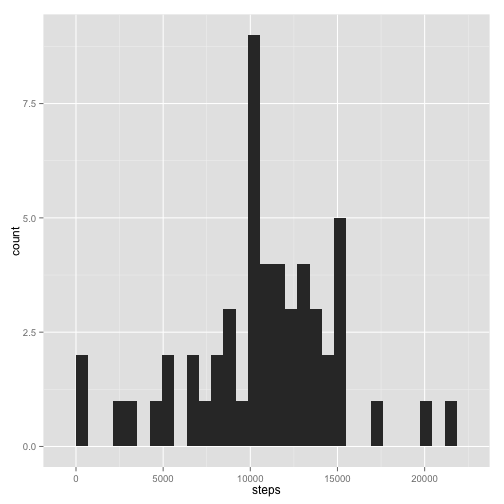
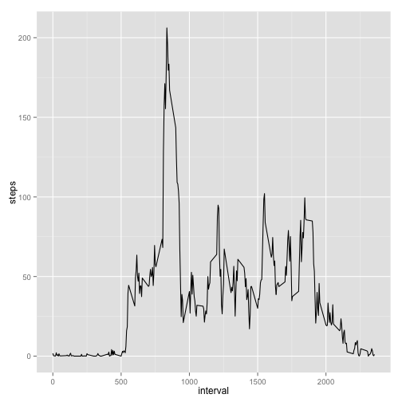
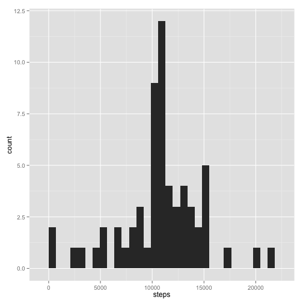
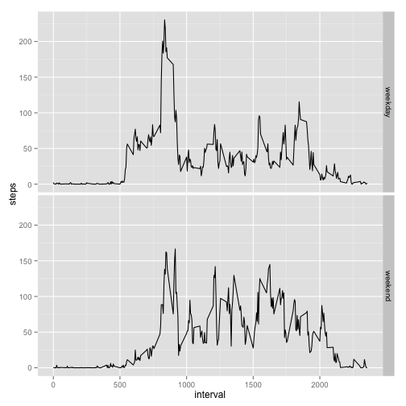
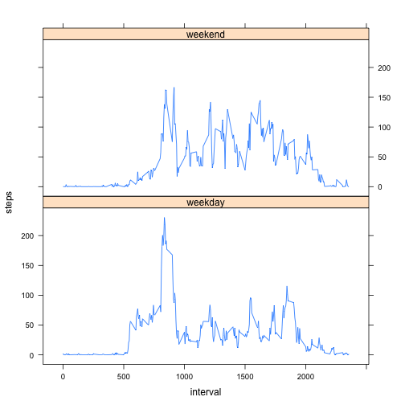

# Reproducible Research: Peer Assessment 1

## Loading and preprocessing the data

```r
download.file("https://d396qusza40orc.cloudfront.net/repdata%2Fdata%2Factivity.zip", 
    destfile = "repdata-data-activity.zip", method = "curl")
unzip("repdata-data-activity.zip")
activity <- read.csv("activity.csv")
library(reshape)
library(reshape2)
```

```
## 
## Attaching package: 'reshape2'
## 
## The following objects are masked from 'package:reshape':
## 
##     colsplit, melt, recast
```

```r
library(ggplot2)
library(lattice)
```

## What is mean total number of steps taken per day?

```r
amdmelt <- melt(activity, id = "date", measure.vars = c("steps", "interval"))
amdcast <- dcast(amdmelt, date ~ variable, sum)
qplot(steps, data = amdcast, geom = "histogram")
```

```
## stat_bin: binwidth defaulted to range/30. Use 'binwidth = x' to adjust this.
```

 

```r
mean(amdcast$steps, na.rm = TRUE)
```

```
## [1] 10766
```

```r
median(amdcast$steps, na.rm = TRUE)
```

```
## [1] 10765
```

## What is the average daily activity pattern?

```r
amdmelt2 <- melt(activity, id = "interval", measure.vars = "steps", na.rm = TRUE)
amdcast2 <- dcast(amdmelt2, interval ~ variable, mean)
adap <- ggplot(amdcast2, aes(interval, steps))
adap + geom_line()
```

 

```r
maxamdcast2 <- amdcast2[amdcast2$steps == max(amdcast2$steps), ]
maxamdcast2$interval
```

```
## [1] 835
```

## Imputing missing values

```r
activity[is.na(activity)] <- amdcast2$steps
amdmelt3 <- melt(activity, id = "date", measure.vars = c("steps", "interval"))
amdcast3 <- dcast(amdmelt3, date ~ variable, sum)
qplot(steps, data = amdcast3, geom = "histogram")
```

```
## stat_bin: binwidth defaulted to range/30. Use 'binwidth = x' to adjust this.
```

 

```r
mean(amdcast3$steps)
```

```
## [1] 10766
```

```r
median(amdcast3$steps)
```

```
## [1] 10766
```

###The mean hasn't changed, but the median has.

## Are there differences in activity patterns between weekdays and weekends?

```r
activity$date <- as.Date(activity$date, format = "%Y-%m-%d")
activity$day <- format(activity$date, "%a")
activity$weekend <- factor(ifelse(activity$day == "Sat" | activity$day == "Sun", 
    "weekend", "weekday"))
airquality <- transform(airquality, Month = factor(Month))
actagg <- aggregate(steps ~ interval + weekend, data = activity, mean)
adap <- ggplot(actagg, aes(interval, steps))
adap + geom_line() + facet_grid(weekend ~ .)
```

 

### Or, in line with the lattice plot shown in the assignment directions:

```r
xyplot(steps ~ interval | weekend, data = actagg, type = "l", layout = c(1, 
    2))
```

 

